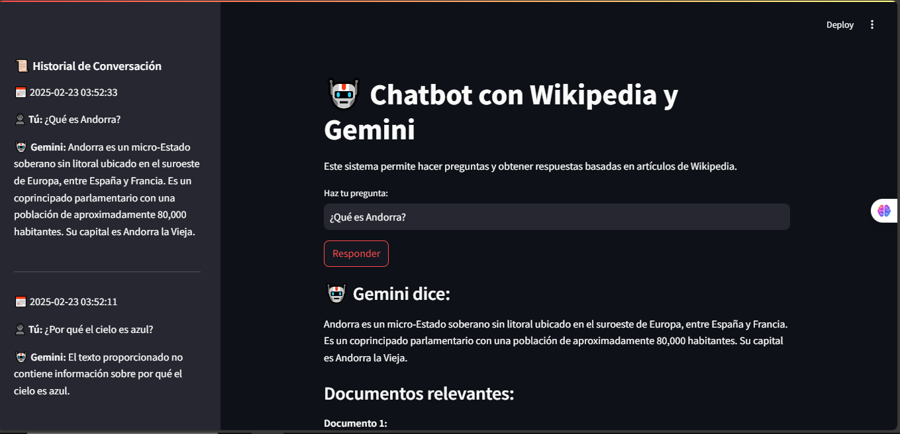

# Chatbot con Wikipedia y Gemini
Este proyecto es un chatbot que utiliza la API de Gemini para generar respuestas basadas en artículos de Wikipedia. Está construido con Streamlit para la interfaz de usuario, FAISS para la búsqueda de documentos relevantes y SQLite para almacenar el historial de conversaciones.

Requisitos previos
Antes de comenzar, asegúrate de tener instalado lo siguiente:

Python 3.8 o superior

pip (gestor de paquetes de Python)

Instalación
Clona el repositorio:

bash
Copy
git clone https://github.com/codemiguel-dev/chatbot_rag
cd tu-repositorio
Crea un entorno virtual (opcional pero recomendado):

bash
Copy
python -m venv venv
source venv/bin/activate  # En Windows usa `venv\Scripts\activate`
Instala las dependencias:

bash
Copy
pip install -r requirements.txt
El archivo requirements.txt debe contener las siguientes dependencias:

Copy
streamlit
google-generativeai
google-api-core
datasets
sentence-transformers
faiss-cpu
numpy
sqlite3
Configuración
Configura la API de Gemini:

Obtén una clave API de Gemini desde Google Cloud Console.

Reemplaza la clave API en el archivo app_web.py:

python
Copy
client = genai.Client(api_key="TU_API_KEY_AQUI")
Configura la base de datos SQLite:

El proyecto utiliza SQLite para almacenar el historial de conversaciones. Asegúrate de que la carpeta database exista en la raíz del proyecto.

Si no existe, créala manualmente:

bash
Copy
mkdir database
La base de datos se creará automáticamente la primera vez que ejecutes la aplicación.

Ejecución
Para ejecutar la aplicación, utiliza el siguiente comando:

bash
Copy
streamlit run app_web.py
Esto iniciará la aplicación en tu navegador web. La interfaz de usuario te permitirá hacer preguntas y obtener respuestas basadas en artículos de Wikipedia.

Estructura del Proyecto
app_web.py: Contiene la lógica principal de la aplicación y la interfaz de usuario con Streamlit.

ia_configuration.py: Contiene las funciones para cargar el dataset de Wikipedia, generar embeddings, crear el índice FAISS y recuperar documentos relevantes.

model.py: Contiene las funciones para interactuar con la base de datos SQLite y guardar/recuperar el historial de conversaciones.

database/: Carpeta que contiene la base de datos SQLite para almacenar el historial de conversaciones.

## Interfaz del Chatbot
